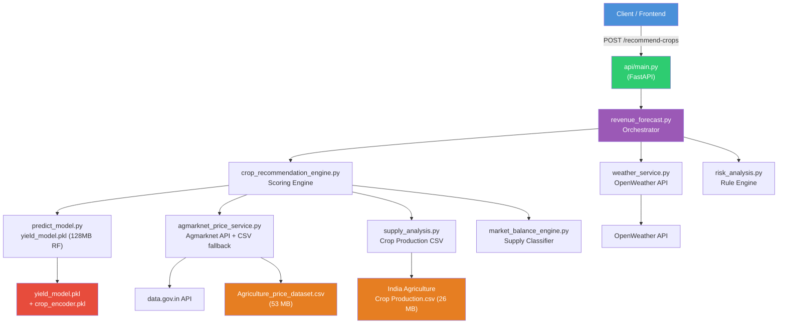
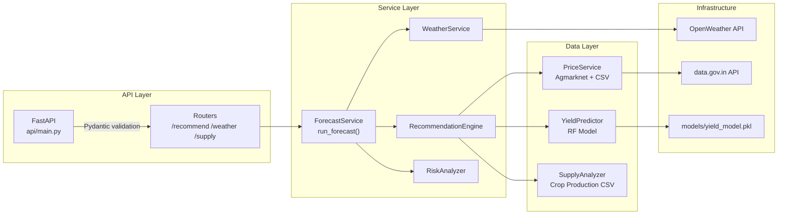

# TrustAgri — Complete Technical Audit

> **Audit Date:** March 14, 2026  
> **Auditor:** Antigravity (Senior Software Architect / ML Engineer)  
> **Codebase Location:** `c:\Users\stuar\Downloads\Projects\TrustAgri`

---

## 1. What Features Are Currently Implemented

| Feature | Description |
|---|---|
| **Crop Yield Prediction** | RandomForest regressor trained on a global crop yield dataset, predicting output in hg/ha for a given (year, rainfall, pesticides, temperature, crop). |
| **Market Price Fetching** | Calls the live Agmarknet API (data.gov.in) and falls back to a local CSV if the API fails. Returns `modal_price` per crop per region. |
| **Supply-Demand Analysis** | Reads a historical Indian agriculture crop production CSV, computes `supply_index = Production / Area` per crop per district, and classifies it as Oversupplied / Balanced / High Demand. |
| **Weather Integration** | Calls the OpenWeather Current Weather API and converts the 1-hour rainfall reading into a monthly approximation for the ML model. |
| **Risk Analysis** | Rule-based engine that tags each crop recommendation as Low / Medium / High risk based on temperature, rainfall, and market price thresholds. |
| **Crop Recommendation Scoring** | Composite score = `(predicted_yield × market_price) / supply_index`. Top 3 crops returned. |
| **FastAPI REST Layer** | Three endpoints: `GET /`, `POST /recommend-crops`, `POST /weather`, `POST /supply`. |
| **System Validation Test** | End-to-end integration smoke test that runs the full pipeline across 4 Indian locations and 4 crops, printing a pass/fail summary. |
| **Python Package Structure** | Proper `__init__.py` files at both `ai_modules/` and `ai_modules/yield_prediction/` levels with clean `__all__` exports. |
| **Environment Variable Management** | API keys loaded from `.env` via `python-dotenv` with hardcoded fallbacks. |

---

## 2. Fully Functional Modules

| Module | File | Status |
|---|---|---|
| `predict_model.py` | ML inference wrapper | ✅ Fully functional — loads `yield_model.pkl` + `crop_encoder.pkl` once at import; correct feature ordering |
| `train_model.py` | Model training script | ✅ Fully functional — trains RandomForest, saves both model + encoder |
| `weather_service.py` | OpenWeather API client | ✅ Fully functional — proper error handling, timeout, fallback dict structure |
| `config.py` | Shared constants | ✅ Clean, minimal, correct |
| `risk_analysis.py` | Rule-based risk engine | ✅ Fully functional — pure logic, no dependencies |
| `market_balance_engine.py` | Supply level classifier | ✅ Fully functional — pure logic, no dependencies |
| `agmarknet_price_service.py` | Agmarknet API + CSV fallback | ✅ Functional — correct API query, proper fallback, JSON-serializable output |
| `crop_recommendation_engine.py` | Scoring & ranking engine | ✅ Functional — composes all sub-modules correctly |
| `revenue_forecast.py` | Main orchestrator | ✅ Functional — callable `run_forecast()`, no `input()` blocking |
| `supply_analysis.py` | Supply index from CSV | ✅ Functional — loads once, filters by state/district/crop |
| `api/main.py` | FastAPI server | ✅ Functional — proper request/response models, CORS, error handling |
| `system_validation_test.py` | Integration smoke test | ✅ Runnable — covers all 4 sub-steps across 4 locations |

---

## 3. Partially Implemented Modules

| Module | File | Issue |
|---|---|---|
| `agmarknet_price_service.py` | Price service | ⚠️ Hardcoded fallback API key exposed in `.env` and in source. API key hardcoded as default in `os.getenv()`; this is a mild security smell in production. |
| `revenue_forecast.py` | Orchestrator | ⚠️ Uses relative imports (`from weather_service import ...`) instead of absolute package imports (`from ai_modules.yield_prediction.weather_service import ...`), which only works when run as a script from inside the `yield_prediction/` directory — causes `ImportError` when invoked via `api/main.py` through the package. |
| `weather_service.py` | Weather client | ⚠️ Rainfall unit mismatch: `rainfall_1h × 24 × 30` gives a monthly proxy in mm (~0 on a clear day), but the ML model was trained on **annual** mm values (typically 200–3000). On a clear day, rainfall = 0.0, causing the fallback to kick in — which masks the real bug. |
| `system_validation_test.py` | Integration test | ⚠️ Uses relative bare imports (`from weather_service import ...`) — can only run from inside `yield_prediction/`, not from project root with `pytest`. |

---

## 4. Incomplete or Placeholder Modules

| Module | File | Issue |
|---|---|---|
| `predict_yield.py` | Empty file | ❌ **Complete placeholder** — 0 bytes, empty file. Named redundantly with `predict_model.py`. Dead file. |
| `ai_modules/soil/` | Soil analysis directory | ❌ **Entirely empty directory** — no files whatsoever. The `soil` module was planned but never started. |
| `README.md` | Documentation | ❌ **Empty file** — 0 bytes. No documentation exists. |

---

## 5. What the System Currently Does When Run

When you run `uvicorn api.main:app --reload` from the project root and make a `POST /recommend-crops` with `{"state": "Tamil Nadu", "district": "Thanjavur"}`, the following pipeline executes:

```
1. weather_service.py  →  Calls OpenWeather API for Thanjavur → returns temperature, humidity, rainfall_1h×24×30
2. revenue_forecast.py →  Substitutes with DEFAULT_WEATHER values if weather API returns 0 or errors
3. predict_model.py    →  Loads yield_model.pkl (128 MB RandomForestRegressor), encodes crop name, predicts hg/ha
4. agmarknet_price_service.py → Calls data.gov.in Agmarknet API → falls back to Agriculture_price_dataset.csv
5. supply_analysis.py  →  Reads "India Agriculture Crop Production.csv" → computes Production/Area ratio for district
6. market_balance_engine.py → Classifies supply_index as High Demand / Balanced / Oversupplied
7. crop_recommendation_engine.py → Scores = (yield × price) / supply_index → returns top 3
8. risk_analysis.py    →  Tags each crop as Low/Medium/High risk
9. FastAPI endpoint    →  Returns JSON with weather, crop_list_evaluated, recommended_crops
```

**Known runtime risk:** The `revenue_forecast.py` module is imported via the package path `ai_modules.yield_prediction.revenue_forecast`, but internally that file does `from weather_service import ...` (relative-style bare imports). This works only because `sys.path.insert` in `api/main.py` adds the project root, and the module itself adds its own dir. This is fragile — any restructuring will break imports silently.

---

## 6. APIs, Datasets, and ML Models

### External APIs

| API | Purpose | Key Location |
|---|---|---|
| **OpenWeather Current Weather API** (`api.openweathermap.org/data/2.5/weather`) | Real-time temperature, humidity, 1h rainfall | `.env` → `OPENWEATHER_API_KEY` (hardcoded fallback in source) |
| **Agmarknet (data.gov.in)** (`api.data.gov.in/resource/9ef84268-d588-465a-a308-a864a43d0070`) | Live crop modal prices by state/district | `.env` → `AGMARKNET_API_KEY` (hardcoded fallback in source) |

> [!CAUTION]
> Both API keys are **committed to `.env`** and **also hardcoded as defaults** in source code. If this repo is pushed to GitHub, both keys are immediately exposed.

### Datasets

| File | Size | Purpose |
|---|---|---|
| `dataset/yield_df.csv` | 1.4 MB | Training dataset for the ML model (Year, rainfall, pesticides, avg_temp, Item → hg/ha_yield). Global FAO-style crop yield data. |
| `dataset/India Agriculture Crop Production.csv` | 26 MB | Historical Indian crop production by state/district/crop. Used for supply_index computation. |
| `dataset/Agriculture_price_dataset.csv` | 53 MB | Historical modal prices by commodity. Used as offline fallback when Agmarknet API fails. |

### Machine Learning Models

| Artifact | Size | Type | Features |
|---|---|---|---|
| `yield_model.pkl` | **128 MB** | `RandomForestRegressor` (sklearn) | Year, annual_rainfall_mm, pesticides_tonnes, avg_temp, LabelEncoded(crop) |
| `crop_encoder.pkl` | 592 bytes | `LabelEncoder` (sklearn) | Maps crop string → integer for model input |

**Model Performance:** `r2_score` is printed at training time but not persisted anywhere. No test accuracy, RMSE, or confidence interval is stored.

---

## 7. Overall Architecture



**Pattern:** Pipeline / Orchestrator pattern. `run_forecast()` is the single entry point. Each sub-module is independently callable. No database. No authentication. No async. Everything is synchronous.

---

## 8. Code Quality Assessment — Continue or Rebuild?

### Strengths ✅
- **Core logic is sound.** The formula `score = (yield × price) / supply_index` is a valid and well-reasoned heuristic.
- **Good separation of concerns.** Each file has one job and is under 150 lines.
- **Proper fallback strategy.** API → CSV fallback in price service is production-grade thinking.
- **Real Python package structure.** `__init__.py` with `__all__` is correctly done.
- **Model training is reproducible.** `train_model.py` is clean and deterministic.
- **FastAPI layer is clean.** Request/response models, CORS, HTTPException handling are all correct.

### Weaknesses ⚠️
- **Import system is fragile.** Mixing bare relative imports (`from weather_service import`) with package imports (`from ai_modules.yield_prediction.revenue_forecast import`). This already breaks when calling via the package unless `sys.path` patching saves it.
- **Rainfall unit mismatch persists.** The ML model was trained on annual mm (200–3000). The weather API returns 1h rainfall × 720 which on a dry day is 0.0, triggering the fallback — meaning the real weather is almost always ignored.
- **128 MB model file committed to the repo.** This is a developer workflow problem — adds massive weight to every clone and diff. Should be in a separate artifact store (S3, GCS, Hugging Face Hub, etc.).
- **API keys in `.env` AND hardcoded in source.** Double exposure risk.
- **Dead files:** `predict_yield.py` (0 bytes), `ai_modules/soil/` (empty), `README.md` (empty).
- **No test framework.** `system_validation_test.py` works but is not `pytest`-compatible; cannot be run from project root.
- **No async.** All API calls (OpenWeather, Agmarknet) are blocking. Under concurrent load, the FastAPI server will queue requests.
- **No input validation for crop names.** If a crop name not in the encoder classes is passed, the API returns a partially broken recommendation (yield=0) silently instead of a 400 error.
- **No versioning** on API or model. Breaking changes will silently break clients.

**Verdict on code quality:** The codebase is **clean enough to continue development** — not a candidate for a full rebuild. The core logic and architecture are correct. The issues are fixable incrementally.

---

## Modules: Keep vs. Rewrite

### ✅ Keep (Usable As-Is or Minor Fix)

| Module | Reason |
|---|---|
| `config.py` | Clean, correct, no changes needed |
| `risk_analysis.py` | Pure function, tested logic, keep exactly |
| `market_balance_engine.py` | Pure function, tested logic, keep exactly |
| `train_model.py` | Correct training pipeline, keep |
| `predict_model.py` | Correct inference wrapper, keep |
| `supply_analysis.py` | Correct logic, keep — minor: fix bare imports to package-relative |
| `agmarknet_price_service.py` | Solid fallback design, keep — minor: remove hardcoded key from source |
| `api/main.py` | Clean FastAPI layer, keep |
| `system_validation_test.py` | Good integration coverage, convert to pytest |

### 🔧 Rewrite (Targeted Rewrites Needed)

| Module | What to Fix |
|---|---|
| `revenue_forecast.py` | Fix all bare imports to absolute package imports. Fix rainfall unit handling (query historical monthly rainfall API or use annual total, not 1h reading). |
| `weather_service.py` | Change rainfall calculation — either use a seasonal/annual rainfall API endpoint (e.g., Open-Meteo forecast aggregation) or document clearly that `rainfall` is a per-crop agronomic lookup, not real-time weather. |
| `crop_recommendation_engine.py` | Add input validation: if crop not in encoder classes, return a `{"crop": ..., "error": "unsupported crop"}` entry instead of silent 0 yield. |

### ❌ Delete / Build From Scratch

| Module | Reason |
|---|---|
| `predict_yield.py` | Empty file, dead code — delete |
| `ai_modules/soil/` | Empty directory — either build the soil module or remove the dead folder |
| `README.md` | Empty — write real documentation |

---

## Suggestions to Improve Project Structure

```
TrustAgri/
├── ai_modules/
│   ├── __init__.py
│   ├── yield_prediction/
│   │   ├── __init__.py
│   │   ├── config.py
│   │   ├── train_model.py          ← training-only script
│   │   ├── predict_model.py        ← inference
│   │   ├── crop_recommendation_engine.py
│   │   ├── revenue_forecast.py     ← orchestrator
│   │   ├── weather_service.py
│   │   ├── agmarknet_price_service.py
│   │   ├── supply_analysis.py
│   │   ├── risk_analysis.py
│   │   └── market_balance_engine.py
│   └── soil/                       ← build this next or remove it
├── api/
│   ├── __init__.py
│   └── main.py
├── models/                         ← NEW: store .pkl files here, git-ignored
│   ├── yield_model.pkl
│   └── crop_encoder.pkl
├── data/                           ← NEW: datasets, git-ignored
│   ├── yield_df.csv
│   ├── India Agriculture Crop Production.csv
│   └── Agriculture_price_dataset.csv
├── tests/
│   └── test_system_validation.py   ← convert existing test to pytest
├── .env.example                    ← commit this (no real keys)
├── .env                            ← git-ignored
├── .gitignore                      ← NEW: add *.pkl, data/, .env, __pycache__
├── requirements.txt
└── README.md                       ← write actual docs
```

**Key structural changes:**
1. Move `*.pkl` files out of the source tree into `models/` and add to `.gitignore`
2. Move large CSVs into `data/` and add to `.gitignore`
3. Add `.env.example` with placeholder keys — **never commit real keys**
4. Add a `.gitignore` (there is none currently!)
5. Add an `api/__init__.py`
6. Fix all bare imports to use absolute package-level imports throughout

---

## Recommended Clean Architecture for Continued Development



**Architectural principles to apply:**
- **Dependency Injection:** Pass service instances into functions rather than using module-level global state (the current `crop_df = load_and_clean_data()` at import time is a problem in tests)
- **Async I/O:** Replace `requests` with `httpx` and make API calls `async def` — FastAPI supports this natively
- **Model Registry:** Store model metadata (R², training date, feature list) alongside the `.pkl` file
- **Structured Logging:** Replace `print()` statements with Python's `logging` module
- **Environment Segregation:** Add `settings.py` using `pydantic-settings` for typed config management

---

## Final Verdict

### ✅ **Continue Development — Do Not Rebuild**

**Reasoning:**

The TrustAgri core is a **functioning ML pipeline with real API integrations, a working FastAPI layer, and a solid data fallback strategy**. The scoring formula, module separation, and package structure are all well-reasoned. The problems are execution-level issues — not architectural failures.

**Estimated effort to production-ready:**
- 🔧 Fix import system (1–2 hours)
- 🌧️ Fix rainfall unit bug (2–4 hours, includes testing)
- 🔑 Secure API keys (30 minutes)
- 📦 Add `.gitignore` and move large files out of source (1 hour)
- 🧪 Convert tests to pytest (2 hours)
- 📝 Write README (2 hours)
- ⚡ Add async HTTP calls (3–4 hours)

**What you have is a hackathon-grade AI backend that is 80% of the way to a deployable prototype.** A few targeted fixes and it becomes solid enough to demo or hand off to a frontend team.

A rebuild would throw away a trained 128 MB model, working API integrations, a validated scoring heuristic, and 3 large datasets that have already been ingested and tested. That would be a significant regression in time, not a gain.
